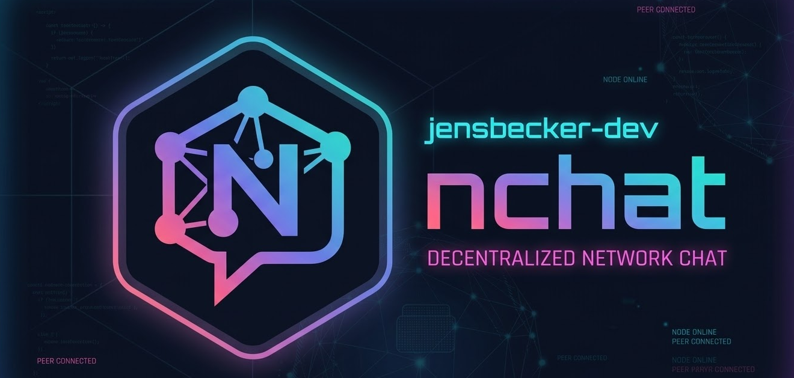

# NCHAT



---

**NCHAT** (NetworkChat) is a local-network-first secure operator chat for security and privacy focused communication.

## Features

- Go backend with encrypted-message relay and persistence
- React + TypeScript frontend with client-side crypto
- RSA-4096 key exchange + AES-256-GCM payload encryption
- Secure file sharing in `public`, `private` and `group` chats (E2E encrypted attachments)
- Realtime stream over WebSocket
- Active gRPC server with protobuf stubs (`backend/gen/chat/v1`)

## Project Structure

```text
.
├── backend/
│   ├── api/proto/chat/v1/chat.proto
│   ├── cmd/nchatd/main.go
│   ├── internal/
│   │   ├── config/
│   │   ├── crypto/
│   │   ├── http/
│   │   ├── model/
│   │   ├── service/
│   │   └── store/
│   ├── migrations/
│   └── .env.example
├── frontend/
│   ├── src/
│   │   ├── lib/
│   │   ├── types/
│   │   ├── App.tsx
│   │   └── main.tsx
│   └── .env.example
├── docs/
│   └── architecture.md
├── screenshots/
│   ├── login.png
│   ├── chat.png
│   └── group_dark_theme.png
├── docker-compose.yml
└── Makefile
```

## Quick Start

### One-Command Launcher

```bash
make launch
```

The launcher starts backend and frontend, waits until both are ready, and opens the chat interface automatically.
If `:8080`, `:9090`, or `:5173` are occupied, the launcher automatically falls back to free ports and wires frontend/backend URLs accordingly.

To stop both processes:

```bash
make stop
```

1. Install dependencies.

```bash
cd backend
go mod tidy

cd ../frontend
npm install
```

1. Run backend and frontend in separate terminals.

```bash
# terminal 1
make backend

# terminal 2
make frontend
```

1. Open `http://localhost:5173`.

## Security Model

- Browser generates RSA key pair per session.
- Backend returns room key encrypted with operator public key.
- Message plaintext is encrypted/decrypted only on clients.
- Backend stores and relays ciphertext, nonce, sender metadata, and timestamps.

## Chat Onboarding Flow

- Choose your username and link node once backend is reachable.
- Your personal Chat ID is shown after link.
- Search chat partners by username or Chat ID via the partner finder.

## Screenshots

### Login


### Chat


### Group Chat (Dark Theme)


## API Endpoints

- `GET /healthz`
- `POST /api/v1/key-exchange`
- `GET /api/v1/messages?clientId=<myId>&limit=200`
- `POST /api/v1/messages`
- `GET /api/v1/users?query=<nameOrId>&excludeClientId=<myId>`
- `GET /ws?clientId=<myId>`

## Security Guardrails

Backend-side limits can be tuned via environment variables:

- `NCHAT_MAX_REQUEST_BODY_BYTES` (default `10485760`)
- `NCHAT_MAX_CIPHERTEXT_CHARS` (default `14680064`)
- `NCHAT_MAX_RECIPIENTS` (default `64`)

## gRPC Service

- Listener: `:9090` (configurable via `NCHAT_GRPC_ADDR`)
- Service: `chat.v1.ChatRelayService`
- RPCs: `SendMessage`, `ListMessages`, `StreamMessages`

## Protobuf Generation

```bash
make proto
```

## Notes

- Designed for local network / air-gapped usage.
- REST/WebSocket and gRPC run side-by-side on the same backend service layer.
